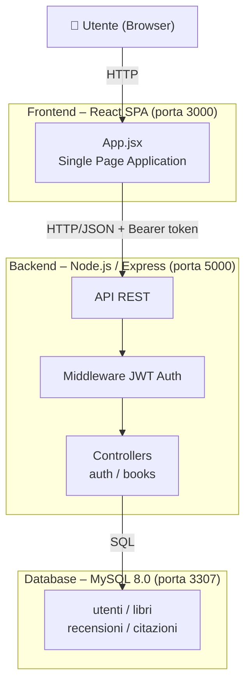
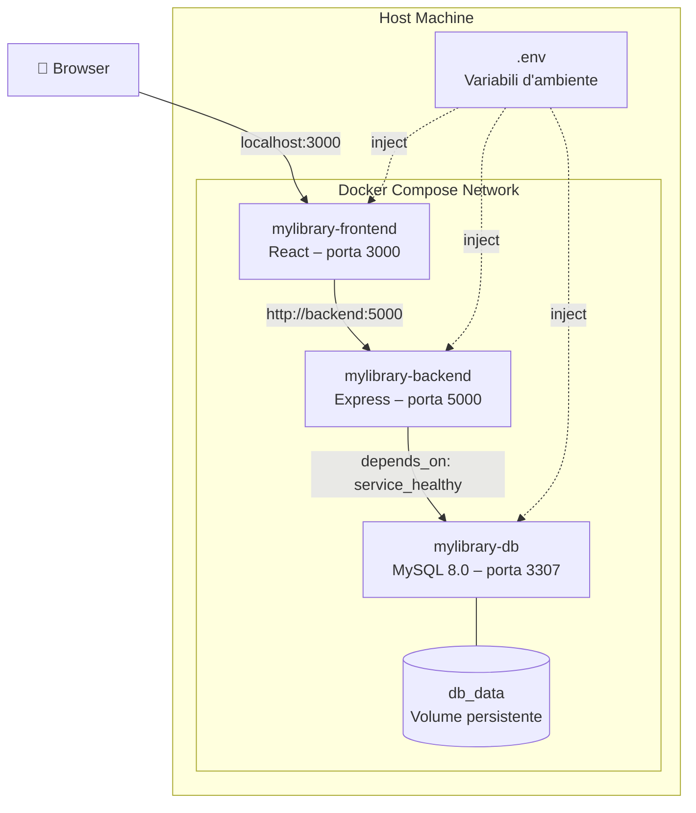

# 📚 MyLibrary – Web Application

MyLibrary è un'applicazione web per la gestione di una libreria personale.  
L'utente, dopo autenticazione, può visualizzare e gestire i propri libri, aggiungere recensioni e citazioni, e interagire con i dati tramite un'interfaccia web responsive.

Il progetto è stato realizzato come parte dell'esame di **Applicazioni Web, Mobile e Cloud** ed è sviluppato come **Single Page Application (SPA)**.

---

## 🚀 Funzionalità principali

- Autenticazione utenti tramite JSON Web Token (JWT)
- Accesso riservato alla libreria personale
- Visualizzazione elenco libri dell'utente autenticato
- Visualizzazione dettaglio di un libro
- Inserimento e visualizzazione recensioni
- Inserimento e visualizzazione citazioni
- Interfaccia responsive, fruibile anche da dispositivi mobile

---

## 🧱 Architettura del progetto

Il progetto segue il paradigma **Single Page Application (SPA)** ed è strutturato secondo un'architettura a tre livelli:

- **Frontend**: applicazione web sviluppata con React
- **Backend**: API REST sviluppate con Node.js ed Express
- **Database**: DBMS relazionale per la persistenza dei dati

La comunicazione tra frontend e backend avviene tramite richieste HTTP in formato JSON.  
Il database non è accessibile direttamente dal frontend, ma esclusivamente tramite le API del backend.

### Struttura del progetto

```
MyLibrary/
├── .github/
│   └── workflows/
│       └── ci.yml
├── backend/
│   ├── src/
│   │   ├── controllers/
│   │   ├── models/
│   │   ├── routes/
│   │   ├── middleware/
│   │   └── app.js
│   ├── tests/
│   │   ├── auth.test.js
│   │   └── books.test.js
│   └── package.json
├── frontend/
│   ├── src/
│   │   ├── components/
│   │   └── App.jsx
│   └── package.json
├── db/
│   └── init/
├── docker-compose.yml
└── .env
```

---

## 🏗 Diagramma Architettura



---

## 🐳 Diagramma Deploy (Docker)



---

## 🛠 Tecnologie utilizzate

### Backend
- Node.js
- Express.js
- JSON Web Token (JWT)
- MySQL
- Pattern MVC (controllers / models / routes)

### Frontend
- React
- Single Page Application senza routing esterno
- Fetch API
- CSS responsive

### DevOps
- Docker
- Docker Compose
- GitHub Actions (pipeline CI/CD)
- Environment Variables per la configurazione

---

## 💡 Scelte progettuali

### Architettura cloud-native (12-Factor App)
Il progetto aderisce ai principi della **12-Factor App**:
- **Codebase**: unico repository Git con tutto il codice
- **Dipendenze**: dichiarate esplicitamente in `package.json`
- **Configurazione**: tutte le credenziali e parametri sono in variabili d'ambiente (file `.env`), mai hardcoded nel codice
- **Backing services**: il database MySQL è trattato come risorsa collegata tramite URL e credenziali, sostituibile senza modificare il codice
- **Build/Run separati**: Docker separa la fase di build (immagine) dall'esecuzione (container)

### Scelta dello stack tecnologico
- **React** è stato scelto per la gestione dello stato dell'interfaccia senza ricaricare la pagina (SPA), ideale per un'applicazione interattiva come una libreria personale
- **Node.js + Express** per il backend: leggero, performante e coerente con il JavaScript del frontend
- **MySQL** come DBMS relazionale, adatto alla struttura con relazioni tra utenti, libri, recensioni e citazioni
- **JWT** per l'autenticazione stateless, coerente con un'architettura REST
- **Docker Compose** per orchestrare i tre servizi (frontend, backend, database) in modo riproducibile su qualsiasi macchina

### Pipeline CI/CD
Ad ogni push su `main`, GitHub Actions esegue automaticamente:
1. Test unitari del backend (Jest + Supertest, senza database reale)
2. Test unitari del frontend (React Testing Library)
3. Build delle immagini Docker per verificare che i container si costruiscano correttamente

---

## 🗄 Database

Il database gestisce le seguenti entità principali:

- **Utenti** — credenziali e profilo
- **Libri** — titolo, autore, stato di lettura, associati all'utente
- **Recensioni** — testo, associate a un libro
- **Citazioni** — testo, associate a un libro

Ogni recensione e citazione è associata a uno specifico libro tramite relazioni tra le tabelle.  
L'inizializzazione del database avviene automaticamente all'avvio dei container Docker tramite script SQL nella cartella `db/init/`.

---

## ⚙️ Installazione e avvio del progetto

### Requisiti
- [Docker Desktop](https://www.docker.com/products/docker-desktop/)
- Docker Compose (incluso in Docker Desktop)

---

### 1. Avvio di Docker

Avviare Docker Desktop e attendere che lo stato diventi **Engine running**.

---

### 2. Clonare il repository

```bash
git clone https://github.com/BeatriceCruciani/MyLibrary.git
cd MyLibrary
```

---

### 3. Configurazione delle variabili d'ambiente

Creare un file `.env` nella root del progetto con il seguente contenuto:

```env
DB_NAME=mylibrary
DB_USER=mylibrary_user
DB_PASSWORD=mylibrary_pass
DB_ROOT_PASSWORD=rootpass

BACKEND_PORT=5000
FRONTEND_PORT=3000

JWT_SECRET=stringa_lunga_random
```

---

### 4. Avvio dell'applicazione

Dalla root del progetto:

```bash
docker compose up -d --build
```

Questo comando:
- costruisce le immagini Docker
- avvia database, backend e frontend
- crea la rete necessaria alla comunicazione tra i servizi
- inizializza il database tramite gli script SQL

---

### 5. Accesso all'applicazione

| Servizio | URL |
|---|---|
| Frontend | http://localhost:3000 |
| Backend API | http://localhost:5000 |

---

### 6. Arresto dell'applicazione

```bash
docker compose down
```

Per rimuovere anche i dati del database:

```bash
docker compose down -v
```

---

### 7. Esecuzione dei test

```bash
cd backend
npm install
npm test
```

---

## 🔄 Pipeline CI/CD

Il progetto utilizza **GitHub Actions** per l'integrazione continua.  
La pipeline si attiva automaticamente ad ogni push su `main` ed esegue:

1. **Backend Unit Tests** — Jest + Supertest (senza database, con mock)
2. **Frontend Unit Tests** — React Testing Library
3. **Docker Build Check** — verifica che le immagini si costruiscano correttamente

Il file di configurazione si trova in `.github/workflows/ci.yml`.

---

## 🔐 Autenticazione

L'applicazione utilizza **JSON Web Token (JWT)**.

- Al login viene restituito un token
- Il token viene inviato nelle richieste protette tramite header: `Authorization: Bearer <token>`
- Le rotte protette consentono l'accesso ai dati dell'utente autenticato
- Il token scade dopo 7 giorni

---

## 👤 Autore

- **Beatrice Cruciani**
- Università degli Studi di Camerino
